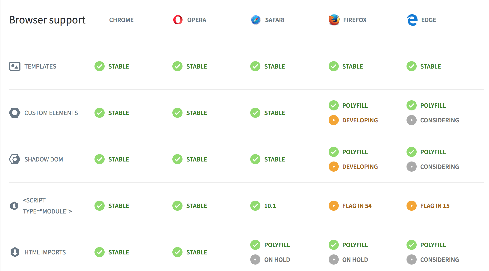

# Welcome to a brave new world

---

## What are web components?
- Reusable pieces of (web) UI
- Has inputs and outputs
- Are parts of a larger whole UI

---

## Who uses web components?
- Angular
- React
- Vue.js
- jQuery (sort of)
- Everyone

----

## So, what's y'ar problem?
- Framework prison
- Re-implement the SAME element every time when I switch a tech stack
- No interopability: I can't share a component between stacks without hacking
- Not all solutions are available in all frameworks

---

## The Web Components **standard**
Supported by evergreen browsers
- HTML Imports
- Templates
- Shadow DOM
- Custom Elements

----



----

#### HTML imports
The "require / import" equivalent for HTML
#### Templates
Reusable, recycled pieces of UI that renders only when you need it to
#### Shadow DOM
Encapsulates style: No need for CSS hacks
#### Custom elements
Sandboxed pieces of UI with internal logic

---

# Pros
- Zero byte dependencies
- Rich API for free
- Component lifecycle
- Easy to code
- Plays nice with every library
- Your HTML is tidy

----

# Cons
Uh, None?

---

# Let's get into details

----

### Lifecycle
```javascript

class MyAwesomeElement extends HTMLElement {
  constructor () {} // initialize here
  connectedCallback () {} // attached to DOM
  disconnectedCallback () {} // removed from DOM
  attributeChangedCallback () {} // respond to attribute changes
}

```

----

### Data flow
- Data goes down
- Events bubble up

----

### Built-in native API
Inherits HTMLElement: You have all you need to behave nicely in a display tree

----

### CSS Encapsulation
Using shadow DOM allows you to write scoped css without messing up with the whole application

----

### Reusablity
- Use HTML imports instead of bundling, only what is required is actually loaded
- Every component can be packed in a single file
- HTTP/2 Adds turbo for loading elements

----

### Testability
Every component can be isolated and tested, no need for custom testing appliances

----

### Debugging
Your have **everything you need** in your browser's built-in developer tools

---

# Code examples

----

#### Using attributes #1
HTML
```HTML
<my-element message="Hello!"></my-element>
```
javascript
```javascript
customElements.define('my-element', class extends HTMLElement {
  connectedCallback () {
    this.textContent = this.getAttribute('message');
  }
});
```

----

#### Using attributes #2
HTML
```HTML
<my-element message="Hello!"></my-element>
```
javascript
```javascript
customElements.define('my-element', class extends HTMLElement {
  static get observedAttributes () {
    return ['message'];
  }
  attributeChangedCallback(attrName, oldValue, newValue) {
    switch (attrName) {
      case 'message': {
        this.textContent = newValue;
      }
    }
  }
});
```

----

### Handling native events
Custom elements are first-class citizens in the DOM
```HTML
<my-element onclick="doSomething(event)"></my-element>
```

----

### Handling custom events
```javascript
document
  .querySelector('my-element')
  .addEventListener('important-event', handleTheEvent);
...
class MyElement extends HTMLElement {
  whenSomethingImportantHappens () {
    const event = new CustomEvent('important-event', {
      bubbles: true, detail: this.importantData})
    this.dispatchEvent(event);
  }
}
```

---

# Does works with
- Webpack? Yes
- jQuery? Yes
- Angular? Yes
- Vue? Yes
- ...

---

# Resources
- [Custom Elements Everywhere](https://custom-elements-everywhere.com/)
- [Introduction to web components](https://www.webcomponents.org/introduction)
- [Development Fundamentals](https://developers.google.com/web/fundamentals/web-components/)
- [Polyfill for crappy browsers](https://github.com/webcomponents/custom-elements)

----

# Libraries
### (for rapid development)
- [Polymer](https://www.polymer-project.org/)
- [slim.js](http://slimjs.com)
- [x-tag](https://x-tag.github.io/)
- [skate-js](http://skatejs.netlify.com/)

----

# Ready-made component libraries
- [Bosonic](https://bosonic.github.io/)
- [Polymer elements catalog](https://elements.polymer-project.org/)
- [Community elements](https://www.webcomponents.org/elements)

----

# Framework integrations
- [Angular](https://www.sitepen.com/blog/2017/09/14/using-web-components-with-angular/)
- [Vue.js](https://alligator.io/vuejs/vue-integrate-web-components/)
- [React](https://reactjs.org/docs/web-components.html)
- [Progressive web apps and web components](https://medium.com/@oneeezy/frameworks-vs-web-components-9a7bd89da9d4)

---

# Thank you
## for using the platform

----

#### Credits
- [Adi Carmel](https://github.com/adica)
- [Liron Hazan](https://github.com/LironHazan)
- [Avichay Eyal](https://github.com/eavichay)
- [Dudu Basher](https://github.com/dudub)
- [Alex Savenok](https://github.com/4z5lz)
